# js-defintive-guide-note
A few things about learning javascript-defintive-guide

# 犀牛书learning

本书的书名包含**“权威”**二字是认真的

## 第一章（javascript简介）

javascript是一门**高级、动态、解释型**编程语言，所有现代web浏览器都包含javascript解释器，几乎所有浏览器都支持ECMAScript

**@ECMAScript**：由于商标问题而重命名的这门语言的标准版本名称，从ES6开始每年发布一次

- **一个hello world**

```js
console.log('Hello World!')
```

## 第二章（词法结构）

**javascript区分大小写**

### 字面量

字面量（literal）是一种直接出现在程序中的数据值

```ini
12
1.2
"hello world"
'Hi'
true
```

上述均为字面量

### 标识符

- 以字母、下划线（`_`）或美元符号（`$`）开头
- 不能以数字开头（以便区分标识符和数值）
- 保留字不能作为标识符（如 if\while\for......）

合法的标识符示例

```ini
i
my_val
v13
_dummy
$str
```

### Unicode

**！！！javascript是使用Unicode字符集编写的**

在字符串和注释中可以使用任意Unicode字符

（注释会被忽略，所以注释中的转义序列会被作为ASCII字符处理，而不会被解释为Unicode）

考虑到**可移植性和易于编辑**，建议标识符中只使用ASCII字母和数字，但这只是一个编程惯例

- **Unicode转义序列**

为方便程序员编码和支持使用老技术的系统，javascript定义了转义序列，从而可以仅仅使用ASCII字符来表示Unicode字符

1. 转义字符以`\u`开头，后跟4位十六进制数字（包括大写或小写的字母A~F），或包含在一对花括号内的1-6位十六进制数字

```ini
cafe'(e头上带一个第二声的音标，暂时不知道怎么打出来)
//可表示为
caf\u00e9
caf\u{E9}
```

！！！带花括号版本的十六进制目的是为了更好的支持大于16位的Unicode码点，比如符号表情

- **Unicode归一化**

**问题根源：**Unicode允许使用多种编码方式来表示同一个字符

而javascript在解释执行过程中是假定自己所执行的源代码已经归一化，所以相同Unicode的表示可能会被识别为两个不同的部分，常常出现在以Unicode作为变量名所带来的问题

**解决：**应该保证使用自己的编辑器或其他工具对自己的源代码执行Unicode归一化

### 可选的分号

javascript的分号是**可选的**，通常会把换行符当作分号，但是并非任何时候都把换行符当作分号

遵循这么一句话：**javascript只在下一个非空格字符无法被解释为当前语句的一部分时才把换行符当作分号**

```js
let a
a
=
3
console.log(a);
//js将以上代码解释为
let a;a=3;console.log(a);
```

因为`let a a `无法被正确解析，所以添加了分号，而`a=3`是连续的且合法的，所以被组合到了一起

**特殊的情况**

1. 涉及`return\throw\yield\break\continue`语句，这几个语句后面的换行符会被解释为`;`

```js
return
true;//vscode内会变灰，即return之后了解释不到
//解析为
return; true;
```

2. 涉及`++或--`操作符

```js
let a=0;
a
++//此处一般在编辑器内会报错
//js解析为
let a=0;a;++;
```

3. 涉及`=>`

规定箭头语法定义的函数，**箭头必须跟参数列表在同一行**

```js
const fn = ()
=> {}//编辑器内报错
```

4. **其他不报错的情况，但是存在语义问题**

```js
let y=x+f
(a+b).toString()
//会被解析成
let y=x+f(a+b).toString();
```

第二行的括号，可以认为是f的一个函数调用，所以被组合到了一起，**但是这可能并不是代码作者的真实意图**

必要的情况下还是需要我们**显示的使用`;`**来让js可以正确理解我们的代码

常见的方式有`;防御`

```js
let x=0
;[x,x+1,x+2].forEach(console.log)
```

## 第三章（类型、值和变量）

计算机程序通过操作值或文本来工作，编程语言中这些可以表示和操作的值被称为类型

**javascript类型分为**：原始数据类型和对象类型，**原始类型的值是不可修改的**

### null和undefined

null可以看成一种特殊的对象，表示没有对象

undefined也表示值不存在，但却更加深层次

```ini
1.变量值未初始化
2.查询不存在的对象属性或数组
3.没有明确返回值的函数
```

- null和undefined是原始值

- null 和 undefined不能调用方法

### 数值字面量

Number是javascript的主要数值类型，用于表示整数和近似实数

js使用 `IEEE754` 标准

### IEEE-754标准

JavaScript 的数字是 IEEE-754 标准存储的双精度浮点数类型。

双精度浮点数总共有 **64 位（bit）**，第一位用于表示符号，接着十一位用于表示阶码，剩余的五十二位用于表示尾数。

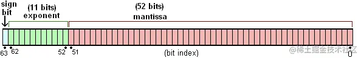

- 浮点数的二进制科学计数法存储，公式表示如下

  - 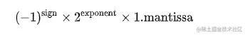

- **符号位：**0表示正数，1表示负数

- **阶码：**表示是2的多少次方（-1023~1024）

  - 阶码使用移码方式存储，偏移值为+1023，也就是需要在二进制运算的基础上，手动减去 1023 才是真正表达的值

  - ```js
    01111111111 // 移码表示，减去1023后为，0
    10000000000 // 1
    11111111110 // 1023
    00000000000 // -1023
    ```

- **尾数：**尾码表示的是小数点后面的部分，以二进制表示的非零数字，第一位有效数字肯定是1，所以**标准规定第一个1不需要存储**

  - 这样设计引出的问题，由于永远都有一个隐藏的1，**如何表示0？**

    标准0的二进制形式为

  - ```js
    0 00000000000 0000000000000000000000000000000000000000000000000000
    //阶码部分是移码表示，减去1023之后，为-1023
    ```

    换算为十进制为 `2^-1023*1.0` ，是一个小到可以忽略不计的极小值

### 二进制浮点数与舍入错误

- **Number.MAX_SAFE_INTEGER**

  - js最大安全整数，这里的安全 指的是**能够 one-by-one 表示的整数**，也就是双精度数表示和整数是一对一的，
    反过来说，在某个范围以内，所有的整数都有唯一的浮点数表示，那这个范围内的数字就叫做这就叫做安全整数

  - **尾数位数决定了最大的整数范围**，若超过尾数最大范围，也就意味着有的数无法表示，在做数值运算时，我们会要求数值以及运算结果必须不能超出 `-Number.MAX_SAFE_INTEGER` ~ `Number.MAX_SAFE_INTEGER` 的范围。

  - 尾数在结构上总共52位，加上隐藏的1总共53位，所以**最大表示为53个1**（`2^53-1`）

    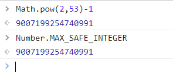

  - 超出范围，会**带来预料之外的结果**

    - `9007199254740992` （即2^53）的二进制形式为：

      ```js
      0 10000110100 0000000000000000000000000000000000000000000000000000
      //中间阶码部分
      ```

      而 `9007199254740993` 的二进制形式**也是！！！**：

      ```js
      0 10000110100 0000000000000000000000000000000000000000000000000000
      ```

      所以如果拿这两个数字判断是否相等，结果当然是 `true！！！`

  - 同样由于数据溢出引起的**0.1+0.2!==0.3**问题

    - 十进制**整数**转二进制，**除二取余法**（例如十进制15转二进制为1111）

      ```js
      15 % 2 === 1, 15 => 7
      7 % 2 === 1, 15 => 3
      3 % 2 === 1, 3 => 1
      1 % 2 === 1, 1 => 0
      //除二直到余数为0
      //1111
      ```

    - 十进制**小数**转二进制，**乘法取整**（十进制0.125为0.001）

      ```js
      //整数部分为0
      //小数部分
      0.125*2=0.25，0
      0.25*2=0.5，0
      0.5*2=1，1
      //小数部分为001
      ```

    十进制 `0.1` 用二进制表示

    ```js
    0.1 * 2 => 0.2, 0
    0.2 * 2 => 0.4, 0
    0.4 * 2 => 0.8, 0
    0.8 * 2 => 1.6, 1
    0.6 * 2 => 1.2, 1
    0.2 * 2 => 0.4, 0
    ...
    ```

    可以看到，0.1 用二进制表示为 `0.00011001100110011...`， 出现了 `0011` 的无限循环，第一个有效数字`1`出现在小数点后第四位，把它往前移动四位，阶码为 `-4`，符号位为 `0`，合在一起就得到 `0.1` 的二进制形式：

    ```js
    0 01111111011 1001100110011001100110011001100110011001100110011010
    ```

    `0.2` 是 `0.1` 的两倍，尾码保持不动，阶码 + 1，得到 `0.2` 的二进制形式：

    ```js
    0 01111111100 1001100110011001100110011001100110011001100110011010
    ```

    到这里，我们知道了，数字 `0.1`，`0.2` 在计算机里表示的时候，本身就存在**精度丢失**（本来无限循环的数字被截断了）。

    0.2 的阶码比 0.1 的阶码大一，我们把 0.1 的尾码右移一位，阶码加 1，让两个数的**阶码保持一致**。

    ```js
    0 01111111100 0.1100110011001100110011001100110011001100110011001101
    0 01111111100 1.1001100110011001100110011001100110011001100110011010
    ```

    现在阶码相同了，尾数相加得到：

    ```js
      0 01111111100  0.1100110011001100110011001100110011001100110011001101
    + 0 01111111100  1.1001100110011001100110011001100110011001100110011010
    = 0 01111111100 10.0110011001100110011001100110011001100110011001100111
    ```

    把运算结果按照 `IEEE-754` 标准格式化，需要向右移动一位，阶码加一。但这时候发现，最后一个 `1` 放不下了，需要舍弃，根据标准当要舍弃一位数时，需要进行`0舍1入`。如果被舍弃的是 `0` 什么都不用做，如果被舍弃的是`1`，则需要补回来。

    ```js
    0 01111111101 0011001100110011001100110011001100110011001100110011 1（1 多出，需要舍弃）
    0 01111111101 0011001100110011001100110011001100110011001100110100  （补 1）
    ```

    于是，我们得到了 0.1 + 0.2 的运算结果。

    ```js
    0 01111111101 0011001100110011001100110011001100110011001100110100
    ```

    再来，使用**乘2取整**的方法，算一下 `0.3` 的二进制是怎么表示的。

    ```js
    0.3 * 2 => 0.6, 0
    0.6 * 2 => 1.2, 1
    0.2 * 2 => 0.4, 0
    0.4 * 2 => 0.8, 0
    0.8 * 2 => 1.6, 1
    0.6 * 2 => 1.2, 1
    ...
    ```
    
    一样出现了循环 `0011`，第一个数字 1 出现在第二位，尾码往前移动两位，阶码为 `-2`。所以 `0.3` 的二进制形式如下：
    
    ```js
    0 01111111101 0011001100110011001100110011001100110011001100110011
    ```
    
    和 `0.1 + 0.2` 的运算结果确实不相等


### js算数运算

运算符：`+`，`-`，`*`，`/`，`%`，`&`，`|`，`**`

Math类提供的函数

```
pow,round,ceil,floor,abs,random,...
```

**算术运算的注意点**

- javascript中的算数在遇到**上溢出、下溢出或被0除**时候不会发生错误
- 数值操作结果超过最大可表示数值（**上溢出**）为`infinity`，负无穷为`-infinity`
- **下溢出**发生在数值操作结果比最小可表示数值更接近0，此时js返回0，如果下溢出来自负数，则返回`-0`

```js
console.log(0 / 14);//0
console.log(14 / 0);//Infinity
console.log(-14 / 0);//-Infinity
console.log(0 / 0);//NaN
console.log(Number.isFinite(Infinity));//false
//Number.isFinite 判断数据是数值还是无穷，数值：true，无穷：false
```

**！！！+0与-0几乎无法区分**

```
0==-0//true
0===-0//true
```

可以使用`Object.is()`来判断

```
Object.is(0,-0)//false
```

### BigInt

ES2020新增，主要是为了表示**64位整数**

**BigInt字面量**（默认10为基数，可添加前缀）

```js
1234n		//一个普通BigInt字面量
0b111111n	//二进制BigInt
0o111n		//八进制BigInt
0x800000n	//64位整数
```

可以使用`BigInt()`函数把常规Javascript数值或字符串转为BigInt值

```js
BigInt(Number.MAX_SAFE_INTEGER)//900719925474099
let str="1"+"0".repeat(100)		//1后跟100个0
BigInt(str)						//10n**100n：一个64位整数
```

**！！！标准的操作符可以用于BigInt，但不能混用BigInt操作数和常规数值操作数**

**！！！Math对象的任何函数都不接收BigInt操作数**

```js
2/2n	//Uncaught TypeError TypeError: Cannot mix BigInt and other types, use explicit conversions
Math.floor(3n)	//Uncaught TypeError TypeError: Cannot convert a BigInt value to a number
```

**但是允许比较操作符混合操作数类型**

```js
1<2n	//true
```

BigInt值的算术运算与常规JavaScript数值算数运算类似，只不过**除法会丢弃余数并且会向下（向0）舍入**

```js
3000n / 997n	//3n，商是3
//3000/997=3.009027...
```

### 日期和时间

主要就是Date对象，其数值表示形式叫时间戳，即1970年1月1日起至今的毫秒数

```js
let timestamp=Date.now();	//当前的时间戳
let now=new Date();			//当前时间的日期对象
let ms=now.getTime();		//转换为毫秒时间戳
let iso=now.toISOString();	//转换为标准格式字符串
```

### 字符码点与字符串

- js使用unicode字符集的UTF-16编码，故js字符串是无符号16位值的序列

- 一个码点（codepoint）是16位的

**码点超出16位问题**

码点超出16位的Unicode字符集使用UTF-16规则编码为两个16位值的序列

**！！！这意味着一个长度为2的js字符串可能表示的是一个unicode字符**

```js
let love="❤"	//❤的UTF-16编码是"\ud83d\udc99"
```

- js的字符串操作方法一般操作的是**16位值（一个码点），而不是字符**
  - 也就是说这些js方法不会对超过一个码点的特殊字符进行特殊处理（归一化）

解决：

- 在es6中，字符串是可迭代的，可以对字符串使用 `for...of` 循环或者 `...` 扩展运算符得到字符的迭代而不是16位码点

### 字符串字面量与转义字符

- js中可以把字符串放在一对匹配的单引号，双引号或者反引号中（支持嵌套）

```js
'test'
"name"
`hwt`
'yes my name is "hwt"'
```

- 早期版本要求字符串字面量必须写在一行，使用+来拼接

```js
let str = 'one '+
'two '+
'three';
console.log(str);
```

- es5之后可以在每行末尾添加一个反斜杠（\）

```js
let str = 'one \
two \
three';
console.log(str);
```

- 反斜杠还可以和后面的既定字符组合，形成转义序列

```js
\0		//NUL字符
\t		//水平制表符
\n		//换行符
\\n		//反斜杠+n
\'		//单引号
\"		//双引号
\r		//回车符
...
e.g.
'you\'re right!'
//you're right! 
```

### 标签化模板字面量

如果在开头的反引号前有一个函数名（标签），那么模板字面量中的文本和表达式值将作为参数传递给这个函数

```js
const tag = function (str) {
    console.log(str[0]);//传递过来是一个对象如下图
};
tag`'one two three\n'`;
//'one two three
//'
```

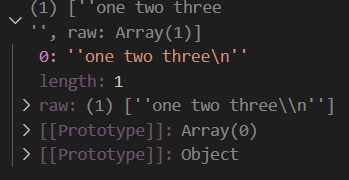

ES6内置一个标签函数：String.row()

返回反引号中未经处理的文本，即不会进行任何转义

```js
console.log(String.raw`'one two three\n'`);
//'one two three\n'
```

### 布尔值

布尔值表示真或假：**true / false**

javascript的任何值都可以转换为布尔值，假值会被转换为false

```js
//假值
undefined
null
0
-0
NaN
""
```

除了假值之外的其他值都可以被转换为`true`

```js
Boolean([])	//true
```

布尔值可以使用toStirng方法将自己转化为"true"或"false"

### 符号symbol

- ES6新增的一种原始类型

- Symbol没有字面量语法，要获取一个Symbol值需要使用`Symbol()`函数
- Symbol函数**永远不会返回相同的值**

为了定义一些可以与其他代码共享的符号值，js定义了一个**全局符号注册表**

`symbol.for()`函数接收一个字符串，返回一个与该字符串相联的符号值（若没有则创建一个新符号）,这点区别于`Symbol()`

```js
let s=Symbol.for("shared");
let t=Symbol.for("shared");
s===t;				//true
s.toString();		//"Symbol(shared)"
Symbol.keyFor(t);	//"shared"
```

### 全局对象

**全局对象的属性是全局性定义的标识符**，可以在javascript程序的任何地方使用

js解析器启动后（如每次浏览器加载新页面），都会创建一个新的全局对象并添加一组初始的属性

类似如下

```ini
undefined\Infinity\NaN		//全局常量
isNaN()\parseInt()\eval()	//全局函数
Date()\RegExp()\String()	//构造函数
Math\JSON					//全局对象
```

- 在node中全局对象有一个名为`global`的属性，值为全局对象本身
- 在浏览器中Window对象充当全局对象角色，这个Window对象有一个自引用的`window`属性
- Worker线程中的代码可以通过`self`来引用他们的全局对象

**ES2020**最终定义了`globalThis`作为在任何上下文中引用全局对象的标准方式

### 不可修改的原始值

- 原始值不可修改

- **对于字符串不可修改的理解**

js**不允许按照某个索引位置来修改字符串**，所有返回一个修改后字符串的方法实际上**返回的都是一个新字符串**

```js
let a = "12345";
a[2] = 'b';
console.log(a);		//"12345"
```

- 原始值是按照值比较的
  - 即两个值只有在他们的值相同时候才是相同的
  - 对于字符串来说当且仅当两个字符串长度相同且每个索引位置字符也相同

### 可修改的对象引用

- 对象是可修改的

```js
let a={x:1};
a.x=2;		//a已被修改为{x:2}
```

- 对象不是按值比较的
  - 两个不同的对象即使拥有完全相同的属性和值，他们也不相同
  - 两个不同的数组，即使每个元素都相同顺序也相同，他们也不相等

```js
let a=[],b=[];
a===b;			//false
a==b;			//false

let c={x:1},d={x:1};
c===d;			//false
c==d;			//false
```

- 对象是按照引用比较的
  - 即两个对象值当且仅当他们引用同一底层对象时，才是相等的

```js
let a=[];
b=a;		//指向同一引用，并不会创建新的对象副本
a===b;		//true
```

### 操作符转换特例

- `+`操作符执行数值加法和字符串拼接
  - 若**一个操作数是对象**，那js会使用无偏好算法将对象转换为原始值，然后当作字符串拼接

```js
let t = { x: 1 };		//原始值为[object Object]
console.log(1 + t);		//1[object Object]
```

​			若**两个操作数都是原始值**，则会检测他们的类型

```js
//若有一个参数是字符串。则把另一个原始值也转换为字符串并拼接
1+"abc";		//"1abc"

//否则把两个参数都转换为数值并把它们相加
1+1;			//2
```

- `==`和`!==`操作符以允许类型转换的方式执行相等和不相等测试
  - 若一个操作数是对象，另一个是原始值，则会使用无偏好算法将对象转为原始值，然后在比较原始值

```js
let a={};				//a作为对象转化为原始值为字符串"[object Object]"
a==[object Object];		//true
```

- `<`，`<=`，`>`，`>=`，既能比较操作符也能比较字符串
  - 若一方为对象，则使用偏数值算法将对象转换为原始值
  - Date对象的数值表示是可以使用 `<` 和 `>` 进行有意义的比较 

### 使用var的变量声明

历史回顾：在es6之前，声明变量的唯一方式就是var，个人愚见，js是一门脚本语言，从这里也可以看出，js在设计上面并没有很好的规定`类型`

var声明变量一些值得注意的点

- 函数体外使用var，则声明全局变量

  - 与使用let const 声明的全局变量区别在于，**通过var声明全局变量作为全局对象的属性**，可以通过**globalThis**引用，**通过let\const声明的全局变量和常量不是全局对象的属性**

    ```
    //函数外部写
    var x=2
    //类似于
    globalThis.x=2
    ```

    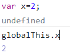

  - 和直接globalThis声明的属性也有所区别，**使用var创建的属性不能用delete删除**（隐式全局变量可以使用delete删除）

    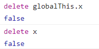

    直接在globalThis上声明的属性则可以使用delete删除

    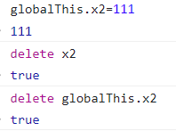

- var 可以**重复声明同名变量**

### 解构赋值

es6实现了一种复合声明与赋值语法，叫做解构赋值

等号右侧为数组或对象，等号左侧通过模拟数组或对象字面量语法，指定一个或多个变量

```js
let [x,y]=[1,2];
//x=1,y=2
```

左侧多余变量会被设置为`undefined`

```js
let [x,y]=[1];
//x:1,y:undefined
```

使用多个逗号`，`可以跳过某些值

```js
let [x,,,y]=[1,2,3,4];
//x:1,y:4
```

还可以使用 `...` 剩余运算符

```js
let [t1,...t2]=[1,2,3,4,5]
//t1:1
//t2:[2, 3, 4, 5]
```

解构赋值**可用于嵌套数组**

```js
let [a,[b,c]]=[1,[2,3],4];
//a:1,b:2,c:3
```

解构的强大之处在于等号右侧并不一定要是数组，确切的说是**可以作为任意的可迭代对象**

```js
//右侧是字符串
let [first,...rest]="Hello";
//first:H,rest:ello

//右侧是对象
let {x,y}={x:1,y:2};
//x:1,y:2
```

**对象的解构赋值支持重命名**

**第一个标识符是待结构对象的原始变量名，第二个标识符为重写的变量名**，这样一来就可以不用在意目标对象的属性顺序，也更符合对象的概念，一个无序的属性集合

```js
let {hws:hxy,hwt:hrq}={hwt:22,hws:10};
//hrq:22,hxy:10
```

## 第四章 表达式与操作符

**表达式**是一个可以被求值并产生一个值的javascript短语，复杂表达式由简单表达式构成。

最简单的表达式称为**主表达式**（独立存在，不再包含更简单表达式的表达式）

基于简单表达式构建复杂表达式最常见的方式是使用**操作符**

### 对象和数组初始化程序

数组初始化程序是一个包含在方括号内的逗号分隔的表达式列表

```js
let matrix=[[1,2,3],[4,5,6]];
//省略逗号间的值可以包含未定义元素
let sparseArray=[1,,,5]
```

数组初始化程序中的元素表达式在每次数组初始化程序被求值时候也会被求值

对象初始化程序表达式与数组类似，方括号变为花括号，支持对象字面量的嵌套

```js
let p={a:{a1:1}};
```

### 属性访问表达式

属性访问表达式求值为对象属性或数组元素的值，故javascript定义了两种访问属性的语法

```js
expression.identifier		//表达式指定对象，标识符指定属性名
expression[expression]		//表达式（对象或数组）后跟另一个位于方括号中的表达式（对象属性名或数组元素索引）
```

**！！！**无论哪种访问方式，位于`'.'`或者`‘[’`前面的表达式都会先求值

！！！若求值结果为null或undefined则表达式会抛出TyprError（因为他们是js中**不能有属性的两个值**）

两种访问表达式，加标识符的语法更加简单，但通过它访问的属性名称必须是合法的，如果属性名中包含空格或标点字符或者是一个数值（对于数组而言），则必须用方括号语法

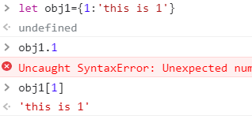

### 条件式属性访问

ES2020新增了两个新的属性访问表达式

```
expression ?. identifier
expression ?.[ expression ]
```

这两个属性访问表达式可以看作是原本的两种属性表达式的扩展

解决了左侧表达式求值后为null or undefined 导致抛出 TypeError的问题

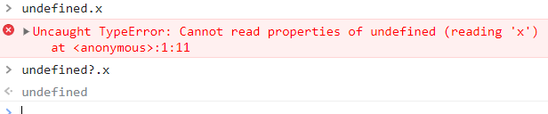

这类属性访问表达式适用于长的链式访问

```js
let a={b:null}
a.b?.c.d	//undefined
```

a.b值为undefined，所以`?.`返回了undefined来作为整个表达式的值，子表达式`.c.d`则不会被求值，换句话说，由于a.b为未定义，则后续c,d无论谁有副效应都不会发生

```js
let a;
let index=0;
try {
	a[index++];
}catch(e){
	console.log(index)	//1
}
a?.[index++]			//undefined
//这里在?.访问符返回undefined之后，后续运算则没有发生，故index++并没有发生运算，index值还是1
console.log(index)		//1
```

下面这种情况则抛出TypeError

```js
(a.b?.c).d
//TypeError
```

因为(a.b?.c)抛出undefined，处理同样可以通过`?.`

```js
(a.b?.c)?.d		//undefined
```

### 调用表达式

调用表达式时js中调用（或执行）函数或方法的一种语法

```
f(0)
Math.max(x,y,z)
...
```

求值调用表达式时，**先求值函数表达式，然后求值参数表达式**产生参数值的列表

如果在第一步求函数表达式时并不是一个函数，则抛出TypeError

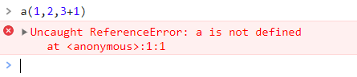

定义函数a之后，表达式正确执行

```js
function a(){
    for(const i of arguments){
    console.log(i);
    }
    //return 'end a'
}
```

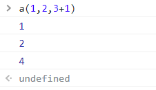

而此时由于定义的**函数体内并没有return语句，则返回undefined**

如在a函数函数体末尾内加上

```js
return 'end a'
```

再次运行表达式得到

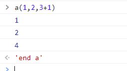

**属性访问表达式运用在调用表达式中，称为方法调用**

在属性访问表达式中，作为属性访问主体的对象或者数组在执行函数体时会变成 `this` 关键字的值

```js
class MyFunc{
    constructor(name){
        this.name=name;
    }
    func1(){
        console.log('your name is '+this.name);
        return 'func1 end'
    }
}
let temp=new MyFunc('hwt');
temp?.func1();
```

上述代码运行结果为

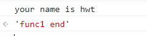


### 条件式调用

在ES2020中可以使用`?.()`来调用函数

如果?左侧的表达式为null或者undefined不会抛出TypeError，而是直接返回整个表达式值为undefined

```js
let f=null,x=0;
try{
	f(x++);				//f为null，抛出TypeError错误
}catch(e){
	console.log(x);		//1，抛出异常前x++执行了
}
//使用条件式调用
let res=f?.(x++);				//f为null，直接返回undefined，且不执行后续代码
console.log(res);				//undefined
console.log(x);					//1
```

### 区别方法调用与函数调用

```
o.m()		//常规属性访问+常规调用
o?.m()		//条件式属性访问+常规调用
o.m?.()		//常规属性访问+条件式调用
```

- 第一种方式：
  - o必须为一个对象，且必须有一个名称为m的属性，m是一个函数
  - 方式一报错TypeError：o为null或undefined；m不为函数；没有m属性或m为null或undefined

- 第二种方式：
  - 条件式属性访问，o可以为null或undefined，此时表达式值为undefined，为其他合法值必须有m属性且m为函数
  - 方式二报错TypeError：m不为函数；没有m属性或m为null或undefined

- 第三种方式：
  - o不能为null或undefined，是则报错，可以没有m属性或m属性为null，此时表达式值为undefined
  - 方式二报错TypeError：o为null或undefined；m不为函数

### 对象创建表达式

对象创建表达式创建一个新对象并调用一个函数（**构造函数**）来初始化这个新对象

**！！！**对象创建表达式类似于调用表达式，**区别在于前面多了一个关键字new**

```js
new myPoint(2,3);
new Object();
//如果不需要给构造函数传参，可以省略括号
new Object
new Date
```

### 操作符概述

操作符在JavaScript中用于算数表达式、比较表达式、逻辑表达式、赋值表达式等

- 操作符可以按照它们**期待的操作数个数**来分类，多数为二元操作符，可以将两个表达式组合成一个更复杂的表达式
- 操作符有自己**适用的操作数类型**，有些操作符适用于任何类型值
  - 每个JavaScript值要么为**“真值”**要么为**“假值“**，因此期待布尔类型值的操作符可以用于任何类型操作数
- **lval**类型即是**leftValue**（左值），是一个历史悠久的术语，意思是：”一个可以合法出现在赋值表达式左侧的表达式“
  - 在JavaScript中，变量、对象属性和数组元素都是”左值“

- **操作符有副效应**，即对他们求值可能会影响将来求值的结果
  - 例如赋值操作符，把一个值赋给变量或属性，会改变后续使用该变量或属性的表达式的值
  - 类似的还有**++，--，delete**

### 操作符优先级

操作符优先级表参见《JavaScript权威指南（第七版）》表4-1，后续称为**表4-1**

- **操作符优先级**，优先级控制操作符被执行的顺序，优先级高的操作符先于优先级低的操作符执行

  - ```js
    w=x+y*z
    //这个表达式中乘法操作符(*)比加法操作符(+)优先级更高
    //所以优先运算y*z，然后将y*z的值与x就行加法运算
    //赋值操作符(=)的优先级最低，故在右侧所有运算完成后，才将结果赋值给左侧变量w
    ```

- 操作符优先级可以通过圆括号（）显式改写

  - ```js
    w=(x+y)*z
    //使用括号来包裹x+y，则强制优先执行括号内表达式运算
    ```

- 属性访问和调用表达式的优先级高于表4-1中所有操作符

  - ```js
    typeof my.functions[x](y)
    //尽管typeof的优先级较高，但typeof的运算必须要基于
    //my.的属性访问；functions[x]数组索引；(y)函数调用
    //故上述操作的优先级全部高于操作符
    ```

### 操作符结合性

**”结合性“**标明了操作符的结合性。**左结合**表示结合性从左到右；**右结合**表示结合性从右到左

- 幂运算、操作并赋值（*=、/=、+=......）、一元运算、三元条件运算、赋值运算**具备右结合性**
- 其余**大部分二元运算具备左结合性**（除去**、=、+=、-=...，即幂运算、赋值运算、赋值并操作运算）

```js
//减操作符（在做减法含义时）具有左结合性，
w=x-y-z ===>等价于 w=((x-y)-z)

//幂操作符**具有右结合性
y=a**b**c ===>等价于 y=(a**(b**c))
```

### 求值顺序

操作符的优先级和结合性规定了**复杂表达式中的操作顺序**，但是并没有规定**子表达式的求值顺序**

！！！JavaScript**始终严格按照从左到右的顺序**对表达式求值

！！！在表达式中可以使用**圆括号来改变乘法加法赋值运算等操作的相对顺序**，但是**不会改变从左到右的求值顺序**（有例外，看下面）

```js
w=x+y*z
//子表达式w首先被求值
//再对x、y、z求值
//然后根据操作符优先级与结合性，决定表达式操作顺序（优先运算y*z，然后将其值与x相加......）
```

！！！求值顺序只在一种情况下会造成差异，即**被求值的表达式具有副效应**

- 如表达式m递增一个变量，而表达式n会使用这个变量，此时保证m优先于n被求值就是必要的，无关从左到右的求值顺序
